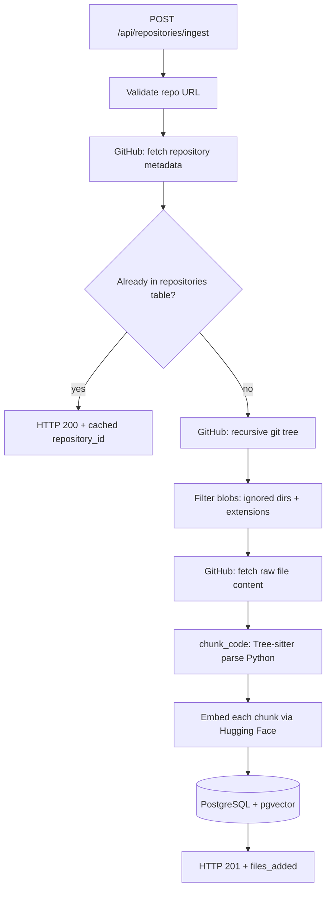
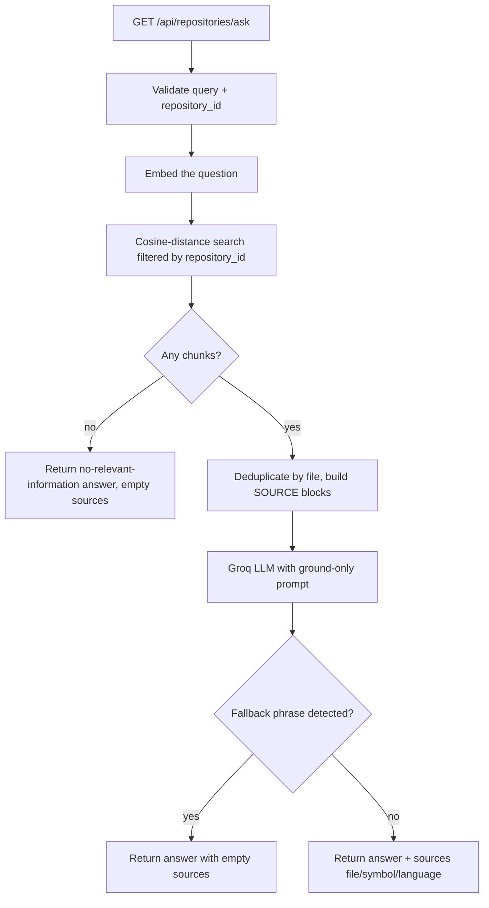

# RepoLens

**Ask a GitHub repository a question in plain English and get an answer grounded in its actual source code - file-level citations included.**

RepoLens is a retrieval-augmented codebase intelligence assistant. It ingests public GitHub repositories, parses them structurally with Tree-sitter, embeds code chunks with a cloud embedding model, stores them in PostgreSQL + pgvector, and answers natural-language questions by retrieving only the relevant code.

Every answer is traceable back to the file and function it came from. When retrieved context is insufficient, RepoLens refuses to guess.

---

## Live Demo

| Service | URL |
|---|---|
| Frontend | `https://repolens-1-6hrm.onrender.com` |
| Backend API | `https://repolens-4omn.onrender.com` |
| API Docs | `https://repolens-4omn.onrender.com/docs` |

---

## Features

- **GitHub repository ingestion** --> paste a URL, validate it, and recursively download + parse the source
- **Structural code parsing** --> Python functions and classes become individual retrieval units with symbol names
- **Repository-scoped retrieval** --> questions are answered using only the ingested repository (no cross-repo contamination)
- **Cloud embeddings** --> `BAAI/bge-small-en-v1.5` (384-dim) via Hugging Face Inference API
- **Grounded generation** --> answers are restricted to retrieved context; insufficient evidence returns an explicit refusal
- **File-level citations** --> every source includes file path, symbol name, and language
- **Caching** --> re-ingesting a repository returns the cached context instantly

---

## Tech Stack

| Component | Technology |
|---|---|
| **Backend** | Python 3.11 · FastAPI · SQLAlchemy |
| **Frontend** | React 19 · Vite · Tailwind CSS |
| **Database** | PostgreSQL + pgvector (Supabase in production) |
| **Embeddings** | BAAI/bge-small-en-v1.5 via Hugging Face API |
| **LLM** | openai/gpt-oss-120b via Groq (temp 0.1) |
| **Code parsing** | Tree-sitter + Python grammar |
| **Deployment** | Docker (backend) · Render · Supabase |

---


## Architecture
### End-to-end pipeline


```text
GitHub Repository URL
        │
        ▼
GitHub API  (metadata + recursive tree + raw file content)
        │
        ▼
Repository / File Ingestion
        │
        ▼
File Filtering  (ignored directories + supported extensions)
        │
        ▼
Tree-sitter Code Parsing & Chunking  (functions / classes → chunks)
        │
        ▼
Cloud Embeddings  (BAAI/bge-small-en-v1.5, 384-dim)
        │
        ▼
PostgreSQL + pgvector  (repositories · repository_files · code_chunks)
        │
        ▼
Query Embedding
        │
        ▼
Repository-scoped Semantic Retrieval  (cosine distance, repository_id filter)
        │
        ▼
Context Construction  (numbered SOURCE blocks: file · symbol · language · code)
        │
        ▼
Groq LLM  (openai/gpt-oss-120b, ground-only prompt)
        │
        ▼
Grounded Answer + Sources
```


### Ingestion path





### Query path




---

## Setup

### Prerequisites

- Python 3.11+, Node.js + npm
- PostgreSQL with pgvector (local Docker Compose or Supabase)
- GitHub token, Groq API key, Hugging Face token

### Local Setup

1. **Clone and configure:**
   ```bash
   git clone https://github.com/Aavi-7582/RepoLens.git
   cd RepoLens
   cp .env.example .env
   ```

2. **Set environment variables in `.env`:**
   ```
   DATABASE_URL=postgresql://<user>:<password>@localhost:5432/<db>
   GROQ_API_KEY=<your-groq-key>
   HF_TOKEN=<your-hugging-face-token>
   GITHUB_TOKEN=<your-github-token>
   FRONTEND_URL=http://localhost:5173
   ```

3. **Start PostgreSQL (optional — use Supabase if you prefer):**
   ```bash
   docker compose up -d postgres
   ```

4. **Run backend:**
   ```bash
   cd backend
   python -m venv venv
   source venv/bin/activate  # or venv\Scripts\activate on Windows
   pip install -r requirements.txt
   uvicorn app.main:app --reload
   ```
   Backend runs on `http://localhost:8000`. Check `/health` and `/health/database`.

5. **Run frontend:**
   ```bash
   cd frontend
   npm install
   npm run dev
   ```
   Frontend runs on `http://localhost:5173`.

---


## API Endpoints

| Method | Path | Purpose |
|---|---|---|
| `POST` | `/api/repositories/ingest` | Ingest a repository URL; returns `repository_id` |
| `GET` | `/api/repositories/ask` | Ask a question over a repository (full RAG) |
| `GET` | `/api/repositories/search` | Retrieve chunks without LLM generation |
| `GET` | `/health` | Liveness check |
| `GET` | `/health/database` | Database connectivity check |

### Example: Ingest a repository
```bash
curl -X POST "http://localhost:8000/api/repositories/ingest" \
  -H "Content-Type: application/json" \
  -d '{"repo_url": "https://github.com/owner/repository"}'
```

Response (first time):
```json
{
  "repository_id": 1,
  "repository": "owner/repository",
  "files_added": 42,
  "cached": false
}
```

### Example: Ask a question
```bash
curl "http://localhost:8000/api/repositories/ask?query=How%20does%20retrieval%20work&repository_id=1"
```

Response:
```json
{
  "answer": "Retrieval filters chunks by repository_id...",
  "sources": [
    {
      "file": "backend/app/services/retriever.py",
      "symbol": "retrieve_similar_chunks",
      "language": "python"
    }
  ]
}
```
---
## Project Structure

```
RepoLens/
├── backend/
│   ├── app/
│   │   ├── main.py                  # FastAPI app, CORS, pgvector bootstrap
│   │   ├── api/repositories.py      # Orchestration + error mapping
│   │   ├── core/                    # Config, database, logging
│   │   ├── models/                  # repositories, repository_files, code_chunks
│   │   ├── schemas/                 # Request validation
│   │   └── services/                # GitHub, parser, chunker, embeddings, retriever, RAG, LLM
│   ├── Dockerfile
│   └── requirements.txt
├── frontend/
│   ├── src/App.jsx, main.jsx
│   ├── vite.config.js
│   ├── package.json
│   └── index.html
├── evaluation/
│   ├── dataset.json                 # 20 curated questions
│   └── evaluate_retrieval.py        # Hit@K measurement
├── docker-compose.yml
└── .env.example
```
---


## How It Works

### Ingestion
1. Validate GitHub URL
2. Fetch repository metadata and default branch
3. Check cache — if already ingested, return existing `repository_id`
4. Recursively download all source files
5. Parse Python files with Tree-sitter (extract functions/classes)
6. Generate embeddings for each chunk
7. Store in PostgreSQL + pgvector

### Querying
1. Embed the user's question
2. Search PostgreSQL for similar chunks (cosine distance), filtered by `repository_id`
3. Deduplicate by file path (max 5 distinct files)
4. Pass retrieved context to Groq LLM with a grounding prompt
5. Return answer + sources (or refusal with empty sources if context is insufficient)

---


## Key Design Principles

- **One retrieval context per question** — repository-scoped filtering prevents cross-repo contamination
- **Grounded generation** — the prompt forbids inventing code; refusals are detected and returned with no sources
- **Structural chunking** — Python functions/classes are single retrieval units, preserving symbol names and boundaries
- **Cloud embeddings** — no local model weights or GPU required; same pipeline in development and production
- **Repository caching** — re-ingesting a URL is instant (no re-download, no re-embed)

---

## Production Deployment

### Backend (Render)
- Deploy `backend/Dockerfile` as a web service
- Set environment variables: `DATABASE_URL`, `GROQ_API_KEY`, `HF_TOKEN`, `GITHUB_TOKEN`, `FRONTEND_URL`
- No secrets in the image

### Frontend (Render)
- Deploy as static site: `npm run build`, publish `dist/`
- Set `VITE_API_URL` to the backend URL (inlined at build time)

### Database (Supabase)
- PostgreSQL with pgvector extension
- SSL connections required
- Tables created automatically at startup

### Deployment checklist
1. Push to GitHub
2. Create Supabase project, copy connection string
3. Deploy backend on Render (Docker), set env vars
4. Verify `/health` and `/health/database` return OK
5. Deploy frontend on Render (static site), set `VITE_API_URL`
6. Smoke test: ingest a repo, ask a question, verify sources

---

## Evaluation

To run the retrieval evaluation yourself:

```bash
cd evaluation
# Set REPOSITORY_ID in evaluate_retrieval.py to an ingested repository's ID
python evaluate_retrieval.py
```

Requires a populated database and valid `HF_TOKEN` / `DATABASE_URL`.

---


## Future Improvements

- Tree-sitter parsers for JavaScript/TypeScript and other languages
- Incremental re-ingestion (update only changed files)
- Streaming answers over server-sent events
- Answer-level evaluation (faithfulness, refusal correctness)
- Larger multi-repository evaluation set
- Ingestion pre-checks (max file size, binary detection)
- Frontend: query history, syntax-highlighted previews
